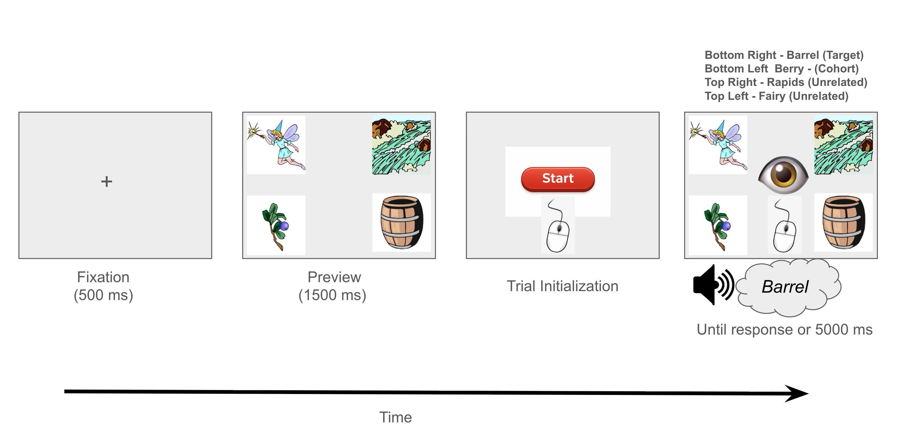

::: callout-note
Stage 1 Registered Report in Behavioral Research Methods (BRM)
:::

Online experimentation in the behavioral sciences has advanced considerably since its introduction at the 1996 Society for Computers in Psychology (SCiP) conference in Chicago, IL [@reips2021]. One methodological domain that has shown particular promise in moving online is eye tracking. Traditionally, eye-tracking studies required controlled laboratory settings equipped with specialized and costly hardware—a process that is both resource- and time-intensive. More recently, however, a growing body of research has shown that eye tracking can be successfully adapted to online environments [e.g., @bogdan2024; @bramlett2024; @özsoy2023; @prystauka2024; @slim2023; @slim2024; @vandercruyssen2023; @vos2022; @jamesWhatParadigmsCan2025; @yangWebcambasedOnlineEyetracking2021]. By leveraging computers with webcams, researchers can now record eye movements remotely, making it possible to collect data from virtually any location at any time. This shift not only enhances scalability, but also broadens access to more diverse and representative participant samples.

Webcam-based eye tracking has become an increasingly viable and accessible method for behavioral research. Implementation typically requires only a standard computing device (e.g., laptop, desktop, tablet, or smartphone) equipped with a built-in or external webcam. Data are collected through a web browser running dedicated software capable of recording and estimating gaze position in real time.

To reliably estimate where users are looking, webcam-based eye tracking typically relies on appearance-based methods, which infer gaze direction directly from visual features of the eye region (e.g., pupil and iris appearance) [@chengAppearancebasedGazeEstimation2024; @saxenaDeepLearningModels2024]. Recent work has extended these methods using deep learning to learn gaze–appearance mappings directly from data [e.g., @Kaduk2024; @saxenaDeepLearningModels2024]. This contrasts with research-grade eye trackers, which use model-based algorithms combining infrared illumination with geometric modeling of the pupil and corneal reflections [@chengAppearancebasedGazeEstimation2024].

The most widely used library for webcam eye tracking is WebGazer.js [@papoutsakiWebGazerScalableWebcam2016a; @patterson2025]. WebGazer.js is an open-source JavaScript library that performs real-time gaze estimation using standard webcams. It is an appearance-based method that leverages computer vision techniques to detect the face and eyes, extract image features, and map these features onto known screen coordinates during a brief calibration procedure. Once trained, gaze locations on the screen are estimated via machine learning [@papoutsakiWebGazerScalableWebcam2016a]. Webgazer.js has been implemented in several experimental platforms, including Gorilla [@Anwyl-Irvine2020], PsychoPy/PsychoJS [@Peirce2019], jsPsych [@de2015], PCIbex [@zehr2022], and Labvanced [@Kaduk2024], making it widely accessible to researchers.

Although webcam eye-tracking is still relatively new, validation efforts are steadily accumulating and the results are encouraging. Researchers have successfully applied webcam eye-tracking with WebGazer.js to domains such as psycholinguistics [@bramlettArtWranglingWorking2025; @prystauka2024; @gellerLanguageBordersStepbystep2025f; @van2024], judgment and decision-making [e.g., @yangWebcambasedOnlineEyetracking2021], and memory [@jamesWhatParadigmsCan2025]. Collectively, this work demonstrates that webcam eye-tracking can yield interpretable and meaningful results that are comparable to those obtained with traditional lab-based systems.

However, there are several limitations associated with webgazer-based eye tracking. First, experimental effects are often smaller and noisier than those observed with research-grade eye trackers [@bogdan2024; @degen2021; @kandel2024; @slim2024; @slim2023; @vandercruyssen2023]. Second, relative to laboratory systems, both spatial accuracy/precision and effective temporal resolution tend to be reduced in webcam-based eye tracking.

Spatial accuracy refers to the extent to which estimated gaze positions deviate from the true point of gaze, whereas precision reflects the consistency of these estimates over time [@carter2020]. In webcam-based systems, spatial accuracy often exceeds 1° of visual angle, with WebGazer.js achieving approximately 4° under laboratory conditions [@semmelmann2018]. Such spatial imprecision can limit the reliable detection of brief or subtle gaze shifts, particularly in tasks that rely on small areas of interest or fine-grained gaze dynamics.

Temporal resolution in webcam-based eye tracking reflects not only the nominal sampling rate of the webcam—most often below 30 Hz [@prystauka2024; @gellerLanguageBordersStepbystep2025f] – but also variability in sampling, execution-time delays, and the alignment of gaze samples with experimental events. Although a 30 Hz sampling rate may be sufficient to capture relatively slow eye-movement latencies, reduced temporal fidelity arising from timing variability and misalignment can impair the estimation of gaze onset, offset, and event-locked dynamics in paradigms requiring precise temporal alignment. Consistent with this, prior work has reported substantial variability in apparent effect timing across tasks and implementations, in some cases exceeding several hundred milliseconds [@semmelmann2018; @slim2024; @slim2023].

Together, these limitations make webcam-based eye tracking using WebGazer.js less suitable for paradigms requiring fine-grained spatial or temporal fidelity—such as tasks involving small or densely spaced areas of interest, rapid stimulus sequences, or millisecond-level event timing [@jamesWhatParadigmsCan2025; @slim2024]. An open question is the extent to which these limitations stem from both the WebGazer.js algorithm itself and environmental/hardware constraints—and, critically, how much each factor independently contributes to data quality. Relatedly, it remains unclear whether improvements to experimental setup (e.g., webcam quality, head stabilization, and execution timing) can meaningfully mitigate these issues. Addressing these questions is essential for determining whether webcam eye tracking should be viewed as fundamentally limited or as a method whose performance can be substantially improved through better implementation.

On the algorithmic side, recent work has demonstrated that modifications to WebGazer.js can yield substantial gains in temporal precision. Specifically, polling the sampling rate consistently and aligning timestamps to data acquisition rather than data completion markedly improves temporal resolution [@jamesWhatParadigmsCan2025; see also @yangWebcambasedOnlineEyetracking2021]. Implementing these changes within online experiment platforms such as Gorilla and jsPsych has brought webcam-based eye-tracking closer to laboratory standards. For example, @prystauka2024 reported timing differences between lab and online of approximately 50 ms, while @gellerLanguageBordersStepbystep2025f observed a 100 ms timing difference. Together, these findings indicate that at least some previously reported timing limitations reflect implementation choices rather than fundamental algorithmic constraints.

Beyond timing, several studies have compared WebGazer-based eye-tracking in controlled laboratory settings to fully remote online data collection, with mixed results. @semmelmann2018 reported reduced spatial noise when WebGazer.js was used in the laboratory, whereas @slim2024 found largely comparable effects between lab-based and remote samples. Importantly, however, these studies were not designed to isolate specific contributors to data quality; instead, they captured broad differences between controlled and uncontrolled testing environments in which multiple factors—hardware, lighting, head movement, and participant behavior—varied simultaneously.

More targeted evidence suggests that hardware quality may nonetheless play a role in shaping webcam-based eye-tracking performance. @slim2023 reported a positive association between sampling rate of webcams and calibration accuracy, and @gellerLanguageBordersStepbystep2025f found that participants who failed calibration more frequently were more likely to report using standard-quality built-in webcams and completing the study in sub-optimal environments (e.g., natural lighting).

Beyond hardware characteristics, participant stability represents another potential contributor to data quality. In laboratory eye-tracking with research-grade systems, head movement substantially degrades spatial accuracy and precision [@hessels2014]. Despite this extensive evidence, no study to date has directly examined the impact of head stabilization on webcam-based eye-tracking.

## Proposed Research

To address environmental and technical sources of noise in webcam eye-tracking, we plan to bring participants into the lab to complete a Gorilla‐hosted webcam task under standardized conditions. We manipulate two key factors (between subjects) across two experiments. Experiment 1 varies external webcam quality (high‐ vs. standard‐quality external cameras). Experiment 2 varies head stabilization (i.e., chin rest vs. no chin rest). All sessions will use identical ambient lighting, fixed viewing distance, the same display/computer model, and controlled network settings. These manipulations specifically target sources of measurement noise induced by the quality of the webcam and the amount of movement by the participant.

To examine these factors, we employed a paradigm widely used in psycholinguistics—the Visual World Paradigm (VWP) [@cooper1974; @tanenhaus1995]. The VWP has been successfully adapted for webcam-based eye tracking [@bramlett2024; @bramlettArtWranglingWorking2025; @gellerLanguageBordersStepbystep2025f; @prystauka2024]. Although implementations vary across studies [see @huettig2011], the version used here investigates phonemic competition, wherein item sets are typically constructed so that the display contains a target (e.g., *mouth*), a cohort competitor (e.g., *house)*, two unrelated items that are unrelated phonemically to the target (e.g., *chain*). This configuration allows researchers to examine the dynamics of lexical competition—for instance, how phonologically similar words such as house (cohort effect) influence online spoken-word processing. Typically, fixations to cohort competitors persist longer or emerge earlier than fixations to unrelated distractors, reflecting transient lexical activation.

In the present study, we focus specifically on cohort competition effects in single-word spoken-word recognition using the Visual World Paradigm (VWP). Several studies [e.g., @gellerLanguageBordersStepbystep2025f; @slim2024] have observed robust cohort competition effects using webcam-based eye tracking. However, effect sizes are sometimes smaller than those reported in traditional lab-based studies [e.g., @slim2024], and effects tend to emerge later in time when measured with standard webcams. This pattern suggests that increased measurement noise in webcam setups primarily introduces temporal delays—and in some cases attenuated effect sizes—rather than fundamentally altering or distorting the underlying dynamics of lexical competition.

The current research aims to inform best practices for webcam-based eye tracking, with particular attention to hardware quality and physical setup considerations (e.g., head movement). Reducing noise by manipulating hardware and head movement is predicted to make the measured gaze signal more stable and less variable across time and trials. In turn, this can make existing effects easier to detect, potentially manifesting as (a) larger and clearer competition effects, (b) earlier and more reliable detection of effect onsets in time-course analyses, and (c) lower calibration failure and attrition rates compared to standard webcams.

While these guidelines will benefit researchers conducting webcam studies in uncontrolled, online settings, they are also valuable for laboratory-based research in which webcams may serve as lower-cost alternatives to infrared eye-tracking systems. By systematically testing the role of hardware and head stabilization, this work clarifies the conditions under which webcam eye tracking can approximate lab-quality data and where its limitations remain.

# Experiment 1: High-Quality Webcam vs. Standard-Quality Webcam

Both @slim2023 and @gellerLanguageBordersStepbystep2025f observed a clear relationship between webcam quality and calibration accuracy in webcam-based eye-tracking. Building on these findings, Experiment 1 tests how webcam quality influences competition effects in a single-word VWP. Specifically, we ask whether a higher-quality webcam yields (a) a greater proportion of looks to relevant interest areas (i.e., greater looks to cohorts vs. unrelated items) (b) an earlier emergence of these effects over time, and (c) lower data attrition rates relative to a lower-quality webcam.

To address this, participants will complete the same VWP task using one of two webcam types: a high-quality external webcam (Logitech Brio) and a standard external webcam designed to emulate a typical built-in laptop camera (Logitech C270). The high-quality webcam offers higher resolution, a higher sampling rate (60 Hz), and greater frame-rate stability, and more consistent illumination handling—factors expected to enhance gaze precision and tracking reliability. In contrast, more standard webcams, while representative of most participants’ home setups, typically provide lower frame rates and exhibit greater variability under different lighting conditions. Comparing these two setups enables a direct assessment of how hardware quality constrains the strength, timing, and reliability of linguistic competition effects in webcam-based eye-tracking.

## Hypotheses

We hypothesize several effects related to competition, onset, and attrition:

### Competition Effects (H1a)

Webcam quality (high vs. standard) will influence the overall proportion of looks, with higher-quality webcams detecting a greater proportion of looks to competitors. To quantify the effect of webcam quality on the proportion of looks within the time window of interest, we will use Cohen’s h—a standardized measure of effect size appropriate for comparisons between two proportions.

### Timing/Onset Effects (H1b)

Each webcam condition will show a change in the proportion of looks to cohorts across time. More specifically, we hypothesize the proportion change will be non-linear across time and that there will be a difference between the two conditions across time. For standard-quality webcams vs. high-quality webcam, onsets will be detected later due to increased noise.

### Attrition (Calibration Failure) (H1c)

Attrition rates due to calibration failure will be lower in the high-quality webcam condition than in the standard-quality webcam condition.

## Method

All stimuli (audio and images), code, and data (raw and summary) will be placed on the Open Science Framework at this link: <https://osf.io/mywtq/>. The entire experiment will be stored on Gorilla's open materials with a link to preview the tasks. In addition, the code and manuscript will be fully reproducible using Quarto and the package manager nix [@nix] in combination with the R package {rix} [@rix] . Together, nix and {rix} enable reproducible computational environments at both the system and package levels. This manuscript and all of the necessary files to reproduce it will be stored on GitHub. Participants will provide informed consent prior to participation. At present, all study procedures are approved by the Boston College Institutional Review Board (IRB) (#26.0130)

### Sampling Goal

We conducted an *a priori* power analysis using the {simr} package in R [@green2016], seeded with pilot data from 21 participants collected online via Gorilla during development of the {webgazeR} package [@gellerLanguageBordersStepbystep2025f]. These pilot data used the same stimuli and visual-world paradigm (VWP) design as the proposed study but did not manipulate webcam quality or head stabilization. Simulations assumed a small effect on the log-odds scale (*b* = 0.10) for the cohort-vs.unrelated contrast, with the planned model fit to each of 5,000 simulated datasets. The simulation model closely mirrored the analytic model planned for the study. Power was estimated as the proportion of simulations in which \|*z*\| exceeded 1.96 for the target effect. Results indicated that 40 participants per group (*N* = 80) would provide approximately 90% power to detect the hypothesized cohort effect. Because the power analysis focused on overall fixation proportions and we additionally plan to examine effects across time, we will recruit 50 participants per group (*N* = 100 total). Participants who fail calibration at any point will be replaced until 100 usable participants (50 per group) are obtained. Analyses of attrition (i.e., failed calibration attempts; see Analysis Plan) will include all participants who enter the study, so the total enrolled may exceed 100. The full power-analysis script is available on OSF (<https://osf.io/4trmn/>). Although the simulation simplifies aspects of the planned design—most notably, it does not incorporate the time-course component—assuming a small effect size yields a conservative estimate of the sample size required to detect the cohort effect.

### Materials

#### VWP

##### Picture Stimuli

Stimuli were adapted from @colby2023. Each stimulus set comprised four images. For the webcam study, we used 60 stimulus sets (30 monosyllabic, 30 bisyllabic). All trials were of the TCUU type (target–cohort–unrelated1–unrelated2), in which a target, its onset cohort competitor, and two unrelated images were displayed (e.g., MOUTH, mouse, chain, house). Both unrelated items were phonologically and semantically unrelated to the target; the two unrelated items were, however, phonologically related to one another. This design yielded 60 trials in total, with each stimulus set contributing one trial. A custom MATLAB script (R2024a; <https://osf.io/x3frv>) generated a unique randomized trial list for each participant, pseudo-randomizing display positions such that the target, cohort, and unrelated images were approximately equally likely to appear in each quadrant across participants.

All 120 images were drawn from a commercial clipart database, selected by a small focus group of students, and edited using a standard lab protocol to ensure a cohesive visual style [@mcmurray2010]. All images were scaled to 300 × 300 pixels.

##### Auditory Stimuli

Auditory stimuli were recorded by a female monolingual speaker of English in a sound-attenuated room sampled at 44.1 kHz. Auditory tokens were edited to reduce noise and remove clicks. They were then amplitude normalized to 70 dB SPL. . All .wav files were converted to .mp3 for online data collection. 

#### Webcams

To manipulate recording quality, two webcams will be used. In the high-quality condition, we will use a Logitech Brio webcam, which records in 4K resolution (up to 4096 × 2160 px) with a 90° field of view and samples at 60 Hz. This setup provides high-fidelity video with greater spatial and temporal precision. In the standard-quality condition, we will use a Logitech C270 HD webcam, which records in 720p resolution and samples at 30 Hz, producing video quality comparable to that of a typical built-in laptop webcam and therefore simulating lower-quality online recordings [see @jarvis2025 for similar use case].

Both webcams will be mounted in a fixed position above the monitor to maintain consistent framing across participants. Lighting will be standardized to ensure uniform image quality across all sessions.

### Experimental Setup and Procedure

All tasks will be completed in a single session lasting approximately 30 minutes. The experiment will be programmed and administered in Gorilla [@Anwyl-Irvine2020] and will run in the Google Chrome browser. Participants will be tested in a dedicated room in the Human Neuroscience Lab at Boston College with two computers and will be seated approximately 65 cm from a 23-inch Dell U2312HM monitor (1920 × 1080 px). Each testing computer will be connected to the same network via a wired ethernet connection (internet speed and latency will be verified using speedtest.net before each session to ensure a download speed of at least 25 Mbps and a ping below 50 ms). Auditory information will be presented over Sony ZX110 headphones to ensure consistent audio delivery and to minimize background noise.

Experimental tasks will be fixed and presented in the following order: informed consent, the single-word visual world paradigm (VWP) task, and a demographic questionnaire. The complete experiment is available for viewing on the Gorilla platform.

#### Webcam Single Word VWP

##### Webcam Calibration

To ensure that participants understood how webcam-based eye tracking works, they first viewed an instructional video demonstrating the calibration procedure (available on OSF at <https://osf.io/6tkbs>). Calibration was completed twice—once at the beginning of the experiment and again after 30 trials. Each calibration session allowed up to three attempts. Participants who did not successfully pass calibration were redirected to the end of the experiment and completed the final questionnaire.\*\*

During calibration, participants were asked to position themselves so that a face mesh could be successfully fit to their face. Once done, participants completed a passive calibration task in which nine red targets were presented sequentially on the screen. Participants were instructed to look directly at each target while it was visible. We used default system parameters for the calibration procedure, including the required fixation duration per target (200 ms), the number of gaze samples used per prediction (10 prediction points), and the transition time before data collection began (1000 ms). Immediately following calibration, validation was performed using five green targets presented one at a time. Participants were again instructed to look directly at each target. During validation, the eye-tracking system evaluated calibration quality by comparing the predicted gaze location to the known target location. Calibration was considered unsuccessful if more than two validation points deviated from their intended target location (i.e., predicted gaze was misaligned with another calibration point). Participants who failed any calibration check were branched to the end of the experiment and asked to complete a brief demographic questionnaire.

##### VWP

After calibration, participants will then complete four practice trials to familiarize themselves with the task. Each trial begins with a 500 ms central fixation cross, followed by a preview display of four images located in the screen’s corners. After 1500 ms, a start button appears at the center; participants click it to confirm fixation before hearing the spoken word. The images remain visible throughout the trial, and participants indicate their response by clicking the image corresponding to the spoken target. A response deadline of 5 seconds will be used. Eye movements will be recorded continuously during the final image display.\*\* Please see @fig-vwp for a schematic of the trial. After the main task, participants complete a brief demographic questionnaire and are thanked for their participation.

{#fig-vwp fig-align="center"}

#### Demographic Questionnaire

After the main task, we will have participants complete a demographic questionnaire. The questions cover basic demographic information, including age, gender, spoken dialect, ethnicity, and race.

### Data Preprocessing and Exclusions

We will follow the guidelines outlined in @gellerLanguageBordersStepbystep2025f and exclude participants with overall task accuracy below 80%, those who report English as not their first language, and those with non-normal or uncorrected vision. At the trial level, only correct-response trials (accuracy = 1) will be retained. Reaction times (RTs) lower or greater than 2.5 SD by-participant will be removed.

For eye-tracking preprocessing we will use the {webgazeR} package in R [@gellerLanguageBordersStepbystep2025f] that contains helper functions to preprocess webcam eye-tracking data. All webcam eye-tracking files and behavioral data will be merged. Data quality will be screened via sampling-rate checks with very low-frequency recordings (\< 30 Hz) by-participant and by-trial excluded [@bramlettArtWranglingWorking2025; @vos2022]. We will quantify out-of-bounds (OOB) samples—gaze points outside the normalized screen (1,1)—and remove participants and trials with excessive OOB data (\> 30%). OOB samples will be discarded prior to analysis. \*\*In addition, Gorilla provides two eye-tracking quality metrics derived from the underlying face-tracking model: convergence and confidence. Convergence (range: 0–1) reflects the model’s certainty that a face has been successfully detected, with higher values indicating poorer convergence on a face. Confidence (range: 0–1) reflects the support vector machine (SVM) classifier’s confidence in the detected face. Trials will be excluded if convergence exceeds 0.5 (indicating unreliable face detection) or if confidence falls below 0.5 (indicating low classifier certainty). To increase signal-to-noise, participants with fewer than 40 usable trials after these exclusions will also be removed.

Areas of Interest (AOIs) will be defined in normalized coordinates as the four screen quadrants, and gaze samples will be assigned to AOIs. Trial time will be aligned to the actual stimulus onset by taking the audio onset metric provided by Gorilla. We then subtract 100 ms due to silence prefixed to the audio recording. 

### Analysis Plan

#### GAMMs

Before fitting the GAMM, the eye-tracking data will be processed to obtain a binomial response suitable for model fitting. Gaze samples will first be binned into 50-ms intervals within each trial.[^1] For each participant, trial, and time bin, we will compute the number of valid gaze samples ("looks") directed to the cohort image and to the unrelated image. For the present analysis, we will include only the unrelated competitor that is fully unrelated to the target. A second competitor, which is phonologically related to the cohort but not to the target, will be excluded from this analysis. Bins containing no looks to either relevant image will be excluded from further analysis. Each remaining bin will then be binarized using a winner-take-all procedure: a bin will be coded as 1 if the cohort image receives more looks than the unrelated competitor in that bin, and 0 otherwise. This binarization will yield a single binary observation per time bin within each trial, effectively downsampling the gaze-sample stream while preserving time-resolved preference dynamics. We will refer to these 0/1 observations as *looks* (rather than *fixations*) to emphasize that the dependent measure is defined over gaze samples rather than discrete oculomotor events.

[^1]: If inspection of the data reveals that each participant × trial × time bin does not contain at least one valid sample, we will aggregate the data into 100 ms time bins and relax the 30 Hz sampling rate requirement (use 15 Hz instead). This approach provides a more conservative temporal resolution while ensuring robust parameter estimation and minimizing unnecessary data loss.

After binarization, trial-level 0/1 looks will be aggregated across trials to obtain binomial counts for each participant × condition × time-bin combination: the number of trials coded as 1 (*cohort_looks*) and the number of trials contributing valid data (*total_looks*). These binomial counts (*cohort_looks* out of *total_looks*) will constitute the response variable in the GAMM. Although *cohort_looks / total_looks* can be interpreted descriptively as the proportion of cohort-dominant bins, proportions will not be precomputed for model fitting. Instead, the GAMM will be fit directly to the binomial counts on a latent log-odds scale, and time-course estimates will be obtained as predicted probabilities from the fitted model.

This simplified analysis approach offers several advantages. First, aggregating gaze data into binomial outcomes substantially reduces data dimensionality and attenuates the extreme temporal autocorrelation that is common in high-frequency eye-tracking data [@verissimo2025novel] . Rather than enabling autocorrelation to be modeled directly, aggregation makes the remaining autocorrelation more tractable. Second, this aggregation strategy permits the use of more parsimonious models that are faster to fit, less computationally intensive to simulate from, and less prone to overfitting [@baayen2017].

To analyze overall competition effects and onset latency, we will use generalized additive mixed models [GAMMs; @Wood2017]. GAMMs extends the generalized linear modeling framework by modeling effects that are expected to vary non-linearly over time–a common feature in the VWP [@brown-schmidt2025; @mitterer2025; @verissimo2025novel; @ito2022]. These models capture non-linear effects by fitting smoothing splines to the data using data-driven, machine-learning-based methods, with the amount of non-linearity captured by how "wiggly" the time course is (one can think of this as the number of bowpoints of a curve). A benefit of this approach is that it reduces the risk of over-fitting and eliminates the need to use polynomial terms, as required in traditional growth curve models [@mirman2014growth] . Importantly, GAMMs also allow researchers to account for autocorrelation in time-series data, which is especially critical in gaze analyses where successive samples are not independent. By modeling the autocorrelation structure, GAMMs provide more accurate estimates of temporal effects and prevent inflation of Type I error rates [@vanrij2019]. In addition to this, fitting GAMMs allow us to estimate the onset of the competition effect in each condition [see @verissimo2025novel].

##### Competition Effects (H1a)

Gaze samples will be analyzed with a binomial (logistic) GAMM using the `bam()` function from the {mgcv} package [@Wood2017]. For visualization, we will employ functions from the {tidygam} package [@tidygam], the {onsets} package [@verissimo2025novel] to examine onset latencies, and the {itsadug} [@itsadug] package for AR functions and to test differences in smooth splines across the time (`get_differences()`). The dependent variable will consist of gaze counts to cohorts compared to unrelated items, for each participant and in each 100ms time bin. All analyses were conducted on a window ranging from stimulus onset (100 ms) to 1200 ms.

The right model in the context of GAMMs is a difficult one. Results have been shown to vary depending on whether one uses an ordered factor scheme or unordered factor scheme with time [@oltrogge2025]. Because of this we plan to fit the model multiple ways to test for robustness. In one model (@lst-gamm) we will fit a model that includes a parametric term for webcam type that is an unordered factor (treatment-coded such that high-quality = 1 and standard-quality = 0). To examine whether webcam type moderates the cohort effect over time, we will include smooth terms for time-by-condition interactions with camera. To account for individual differences, we will include participant-specific random smooths for time, and participant-specific random smooths for time within each level of the camera factor.

This specification allows the model to capture three components:

1.  The overall (parametric) effect of webcam type on the proportion of looks to cohorts-over-unrelated items. Here, the intercept reflects the expected proportion of looks in the standard-quality condition, and the webcam coefficient reflects the difference in looks between high- and standard-quality webcams.
2.  Condition-specific, time-varying trajectories in cohort competition (via the smooth terms), which support inferences about the timing (onsets) and dynamics of cohort effects across conditions. With an unordered factor, the model estimates time smooths for each condition separately with the *p*-value telling us if each smooth differs from zero.
3.  Deviations from these group-level trajectories at the individual participant level (via random smooths)

In a second instantiation of the model (see @lst-gamm-ordered), we will include a parametric term for webcam type treated as an ordered factor. To assess whether webcam type moderates the cohort-over-unrelated effect over time, we will incorporate smooth terms for time as well as time-by-condition interactions, as required when fitting ordered factors.

This specification allows the model to capture the same effects above with one key difference: By including an ordered factor we must include separate smooths for time (the reference) and time x webcam type interaction. This model estimates a baseline smooth for the standard-quality webcam and a difference smooth for the high-quality webcam. Because the webcam factor is ordered, the difference smooth directly represents how the trajectory for high-quality deviates from the standard-quality trajectory. This structure enables inferences about the timing and dynamics of cohort effects across webcam conditions. We will also look at how changing the order affects inferences.

For both models, we use default arguments for the smooth functions (k = 10); however deviations from this default will reported and robustness will be tested.

Although “maximal” random-effects structures are often recommended in linear mixed-effects models [@barr2013], such specifications can be computationally prohibitive in GAMMs. The present specification follows the recommendations of @verissimo2025novel. Statistical significance will be assessed at $\alpha$ = .05. When fitting difference curves with ordered factors with simultaneous CIs, we will correct for multiple comparisons using a Bonferroni correction [@krause2024].

To account for autocorrelation in the residuals, we will first fit the model without an autoregressive term in order to estimate the autocorrelation parameter (ρ). We will then re-fit the model including a first-order autoregressive process (AR(1)) to properly model temporal dependencies. Although using larger time bins can reduce autocorrelation, it does not eliminate it entirely, so explicitly modeling residual autocorrelation ensures valid statistical inference.

##### Onset Effects (H1b)

Once the models are fit, we will extract predicted gaze curves for each condition using the {onsets} package [@verissimo2025novel]. The {onsets} procedure first simulates gaze curves across time from the fitted GAMMs (N = 10,000). For each simulated curve, the onset of the condition effect is identified by comparing the predicted log-odds at each timepoint to a predefined criterion. Within the package, onset is defined as the earliest time at which the predicted log-odds is significantly greater than the model-predicted log-odds at the first timepoint of the analysis window (here word onset). Repeating this procedure across 10,000 simulations yields a distribution of onset estimates, from which a 95% highest density interval (HDI) can be obtained. To derive between-condition comparisons, onset times from paired simulations are subtracted, producing a corresponding distribution with median onset difference and its associated 95% HDI (see @lst-onset for the analysis code).

\small

```{r}
#| eval: false
#| lst-label: lst-pack
#| lst-cap: R packages to load
# load packages
library(mgcv) # perform gam
library(tidygam) # visualization of gams
library(itsadug) # get_differences
library(onsets) # onset differences
```

```{r}
#| lst-label: lst-gamm 
#| lst-cap: GAMM model set--up unordered camera factor
#| eval: false


# set contrasts
options(contrasts = rep("contr.treatment", 2)) # treatment code variables

# combine levels of both factors into one factor 
dat$camera <- as.factor(dat$camera)

# get start event for AR
start_event = start_event(dat, column = "Time", # for ar
                                     event = c("subj", "Trial"), 
                                     label = "start.event",
                                     label.event = NULL, 
                                     order = FALSE)$start.event)
# quick rho estimate (fit once without AR to get residual ACF ~ lag1)

m0 <- 
bam(cbind(look_cohort, look_unrelated) ~ 1 + 
    camera + s(time, by = camera, k = 10) + 
    s(participant, by=camera, bs = "re") +
    s(time, participant, by=camera, bs = "re"), 
    family = binomial(), method = "fREML",
  discrete = TRUE, data = dat, na.action = na.omit)
    
rho  <- acf(residuals(m0, type = "pearson"), plot = FALSE)$acf[2]

# final model with AR(1) to handle within-series autocorrelation

m1 <- 
bam(cbind(look_cohort, look_unrelated) ~ 1 + 
    camera + s(time, by = camera, k = 10) + 
    s(participant, by=camera, bs = "re") +
    s(time, participant, by=camera, bs = "re") + 
    rho=rho, AR.start = start_event)

```

```{r}
#| eval: false
#| lst-label: lst-gamm-ordered
#| lst-cap: GAMM model set--up ordered camera factor

dat$camera_ord <- factor(dat$camera, ordered = T)

# get start event for AR
start_event = start_event(dat, column = "Time", # for ar
                                     event = c("subject", "Trial"), 
                                     label = "start.event",
                                     label.event = NULL, 
                                     order = FALSE)$start.event)
# quick rho estimate (fit once without AR to get residual ACF ~ lag1)

m0 <- 
bam(cbind(look_cohort, look_unrelated) ~ 1 + 
    Condition_ord + s(Time) + 
    s(Time, by=Condition_ord) + 
    (Participant, bs="re") + 
    s(Participant, by=Condition_ord, bs="re") + 
    s(Participant, Time, bs="re") + 
    s(Participant, Time, by=Condition_ord, bs="re"), 
    family = binomial(), method = "fREML",
  discrete = TRUE, data = dat, na.action = na.omit)
    
rho  <- acf(residuals(m0, type = "pearson"), plot = FALSE)$acf[2]

# final model with AR(1) to handle within-series autocorrelation

m1 <- 
bam(cbind(look_cohort, look_unrelated) ~ 1 + 
     Condition_ord + s(Time) + 
    s(Time, by=Condition_ord) + 
    (Participant, bs="re") + 
    s(Participant, by=Condition_ord, bs="re") + 
    s(Participant, Time, bs="re") + 
    s(Participant, Time, by=Condition_ord, bs="re"), 
    family = binomial(), method = "fREML",
  discrete = TRUE, data = dat, na.action = na.omit, 
    rho=rho, AR.start = start_event)

```

```{r}
#| eval: false
#| lst-label: lst-onset
#| lst-cap: Getting onset differences using the {onsets} package for unordered model
# Obtain onsets in each condition (and their differences)

onsets_comp <- get_onsets(model = m1,               # Fitted GAMM
                       time_var = "time",           # Name of time variabl
                 by_var = "camera",        # Name of condition/group variable
                          compare = T,              # Obtain differences between onsets
                          n_samples = 10000,           # Large number of samples (less variable results)
                          seed = 1)            # Random seed for reproducibility
```

```{r}
#| eval: false
#| lst-label: lst-onset-ordered
#| lst-cap: Getting onset differences using the {onsets} package for ordered model
# Obtain onsets in each condition (and their differences)

onsets_comp <- get_onsets(model = m1,               # Fitted GAMM
                       time_var = "time",           # Name of time variabl
                 by_var = "camera_ord",    # Name of condition/group variable
                          compare = T,              # Obtain differences between onsets
                          n_samples = 10000,           # Large number of samples (less variable results)
                          seed = 1)                  # Random seed for reproducibility
```

\normalsize

#### Attrition (Calibration Failure) (H1c)

To examine whether webcam type affects calibration failure and thus removal from the study, we will fit a logistic regression model using the `glm()` function (see @lst-glm). Calibration outcome will be coded as a binary variable, where 0 indicates that a participant failed to calibrate at either of the calibration phases, and *1* indicates that the participant successfully passed both calibration phases. This model will allow us to estimate whether the webcam condition reliably predicts the probability of successful calibration.

\small

```{r}
#| lst-label: lst-glm
#| lst-cap: Logistic model to examine the effect of webcams on calibration
#| eval: false
# fit glm model
glm(calibration ~ camera, family = binomial(link = "logit"))
```

\normalsize

# Experiment 2: Head Stabilization (Chin Rest) vs. No Head Stabilization (No Chin Rest)

In Experiment 2, we use the same standard-quality external webcam as in Experiment 1 but manipulate head stability by comparing a chin-rest condition with a no–chin-rest condition. Prior work using laboratory-based eye-tracking systems has shown that head movement can substantially degrade the accuracy and reliability of gaze estimates. For example, @hessels2014 demonstrated that even moderate deviations in head position can produce systematic calibration drift, increased data loss, and slower recovery following tracking loss. Importantly, these effects are not restricted to extreme movements and can arise during typical participant behavior when head position is unconstrained.

**Although some online platforms, such as LabVanced [@Finger2017LabVanced], offer plug-and-play proprietary solutions for head tracking or motion monitoring, other commonly used platforms, such as PsychoPy [@Peirce2019] and Gorilla [@Anwyl-Irvine2020], require custom code to implement comparable functionality when using WebGazer.js. At present, it remains unclear how warning-based motion-control approaches (e.g., on-screen prompts triggered by excessive head movement) interact with WebGazer’s estimates of event detection, onset latency, and gaze competition.**

**In laboratory-based eye-tracking, chin rests are routinely used to stabilize head position so that gaze estimates primarily reflect eye movements rather than head motion. While chin rests are uncommon in fully remote testing, introducing a chin-rest manipulation in the present study provides a controlled and conservative test of the causal role of head stability in webcam-based eye-tracking. Specifically, the chin-rest condition serves as a theoretically motivated proxy for instruction-based or software-based head-stabilization approaches and allows us to estimate an upper bound on the benefits that head-movement control may provide for calibration quality, competition effects, event-detection timing, and participant attrition.**

## Hypotheses

**The hypotheses for Experiment 2 are identical to those of Experiment 1 and are as follows:**

### Competition Effects (H2a)

Heads stability (chin rest vs. no chin rest) will influence the overall proportion of looks, with the chin rest condition detecting a greater proportion of competitor looks. To quantify the effect of head stabilization on the proportion of looks within the time window of interest, we will use Cohen’s h—a standardized measure of effect size appropriate for comparisons between two proportions.

### Timing/Onset Effects (H2b)

Each condition will show a change in the proportion of looks across time. More specifically we hypothesize the proportion change will be non-linear across time and that there will be a difference between the two conditions across time. For the no chin-rest condition compared to the chin-rest condition, onsets will be detected later due to increased noise.

### Attrition (Calibration Failure) (H2c)

**Attrition due to calibration failures** will be lower in the high-quality webcam condition than in the standard-quality webcam condition.

## Sampling Goal, Materials, Procedure, and Analysis Plan

The sampling goal, materials, procedure, and analysis plan are the same as Experiment 1. The main difference is whether participants use a chin rest or not.



# Declarations

## Funding

This study was funded by the main author.

## Conflicts of Interest

The authors declare no conflicts of interest.

## Ethics Approval

This study was approved by the relevant ethics committee.

## Consent for Publication

I consent for my paper to be published in BRM.

## Consent to Participate

All participants will provide informed consent prior to participation.

## Availability of Data, Code, and Materials

All data, code, and materials will be stored on OSF ([https://osf.io/cf6xr/](https://osf.io/cf6xr/overview))

## Authors’ Contributions

-   JG - Writing—original draft
-   JV - Writing—review & editing
-   JD - Writing—review & editing

